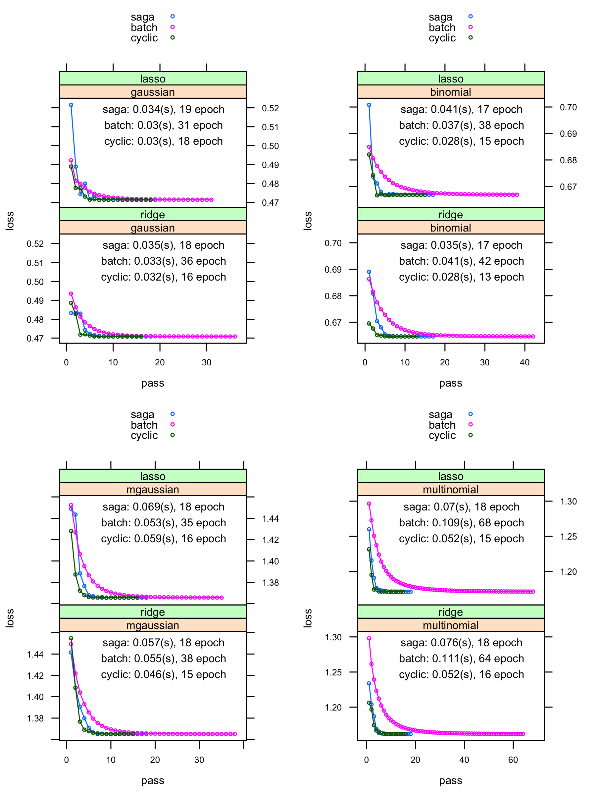

# New SAGA Features

<p style="text-align:justify;">
The incremental gradient method SAGA [@defazio2014] used in **sgdnet** now supports two recently proposed methods for performance enhancement, they are C-SAGA [@park2018] and mini-batch SAGA [@Gazagnadou2019], as well as specifying observation weights.
</p>

## C-SAGA

<p style="text-align:justify;">
C-SAGA has the same algorithmic structure as SAGA, except for that the choice of gradient is cyclic rather than random, which could benefit from cache locality for a certain size of feature matrix. Considering the problem size and cache size, user can enable it by setting ```cyclic = TRUE``` in ```sgdnet()``` function, which is ```FALSE``` by default. 
</p>

## Mini-batch SAGA

<p style="text-align:justify;">
The JackSketch version of b-nice SAGA will sample a fresh batch batch without replacement at each iteration. Then use this batch of gradient to update the estimation of average gradient and the gradient table. Compared with original [saga](https://jolars.github.io/sgdnet/articles/algorithm.html), we could have a look at mini-batch's implementation in **sgdnet**
</p>


```{r eval = FALSE}
y           response vector of size n
X           a columnwsie p by n feature matrix
B           batch size
beta        vector of coefficients of size p
g_avg       gradient average
max_iter    maximum number of outer iterations
eta         the step size

epoch = floor(n_samples/B)
for i in 1:max_iter

    # a index matrix of B by epoch size
    ind <- Ind(n_sample, B)
    
    for k in 1:epoch
        X_batch <- X[ ,ind[,k]]
        
        # Compute a matrix of conditional mean given x_batch
        E[X] <- DotProduct(beta, X_batch)
        
        # Compute a matrix of new gradient
        g_batch  <- Gradient(E[X], y)
        g_change <- g_memory[ ,ind[,k]] - g_batch
        
        # Update gradient table
        g_memory[ ,ind[,k]] <- g_batch
        
        # The gradient average step
        step <- Step(g_change, X_batch)
        beta <- beta - (step/B)*eta - eta*g_avg
        
        # apply penalty
        Penalty(beta, eta)
        
        # Update gradient average
        g_avg <- g_avg + rowSums(g_change)/n_samples

    # Check convergence
    if (MaxChange(beta)/Max(beta) < thresh)  
      stop # algorithm as converged

```

<p style="text-align:justify;">
To use mini-batch version of saga, user could set ```batchsize``` variable to any integer that less than sample size in ```sgdnet()``` function, which is set to 1 by default.
</p>

## Simulated Data

<p style="text-align:justify;">
Here is a benchmark [(R Sript)](https://github.com/wzzlcss/wzzlcss.github.io/blob/master/Rscript/2.3/artifical_bench.R) with artificial data of size 100 to illustrate C-SAGA and mini-batch SAGA's features, where the batch size is fixed to 10 and $\lambda = 0.01$. The C-SAGA is more efficient at evaluating each epoch.
</p>



## Observation weight
<p style="text-align:justify;">
The regularized generalized linear model with observation weight is of the type
</p>
$$
\min_{\beta_0, \beta} \left\{-\frac1n \mathcal{L}\left(\beta_0,\beta; \mathbf{y}, \mathbf{W} \mathbf{X}\right)+ h_{\lambda}(\beta) \right \},
$$
<p style="text-align:justify;">
where $\mathbf{W}$ is a $n$ by $n$ diagonal matrix with weight $w_i$ for $x_i$ along its diagnoal, and $h_{\lambda}(\beta)$ is the penalty function with $\lambda$ as the regularization strength. In **sgdnet**, user can input a vector of size n for $\mathbf{W}$, whose sum should be $n$.
</p>

```{r weight2, eval=FALSE}
sgdnet(x, y, weights = c(0.5, 1.5, rep(1, n-2)))
```


