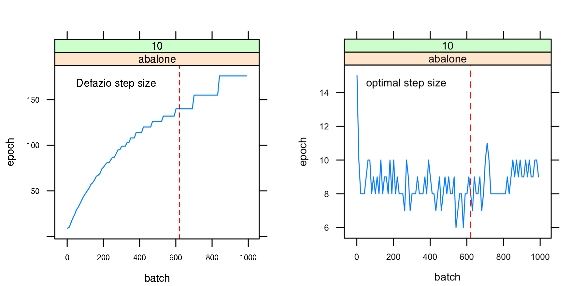
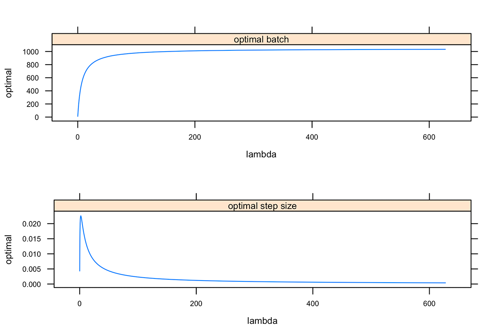
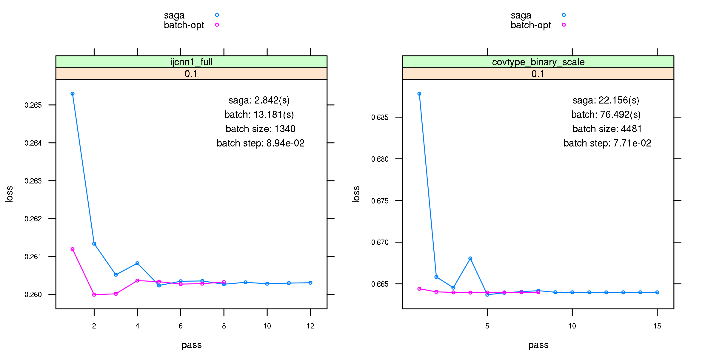

# Optimize Mini-Batching

<p style="text-align:justify;">
The enhancement for SAGA performance by mini-batching depends on two things. Firstly, mini-batching is expected to benefit from the efficiency of vectorized computation, which reduces the cost of a single epoch. Secondly, while the total complexity of SAGA decreases linearly in batch size up to a certain value, emperical study also shows that the complexity explodes with values greater than an optimal mini-batch size [@Gazagnadou2019]. Therefore, we expect a batch size at the optimal point with vectorized computation to bring us the best performance enhancement.
</p>

## Optimal batch size and step size for ridge

<p style="text-align:justify;">
For ridge regression, the SAGA step size $\eta$ proposed by Defazio is defined as $\eta_{\text{Defazio}} = \frac{1}{3(\mu n + L_{\text{max}})}$ [@defazio2014], where the maximum smoothness constant $L_{\text{max}}$ is bound by the largest sample-wise squared norm of the feature matrix. The optimal $\eta_{\text{optimal}}$ and batch size $\mathcal{B}^*$ for SAGA proposed by Gazagnadou are:

$$\begin{align}
\mathcal{B}^*  &=  \left \lfloor 1 + \frac{\mu (n-1)}{4 (\overline{L} + \lambda)} \right \rfloor \\
\eta_{\text{optimal}} &=  \frac{1}{4} \frac{1}{\text{max} \Big \{ \mathcal{L}(b) + \lambda, \frac{1}{b} \frac{n-b}{n-1} L_{\text{max}} + \frac{\mu n}{4 b} \Big \}} \\
\mathcal{L}(b) &= \frac{n(b - 1)}{b(n-1)} L + \frac{n - b}{b(n-1)} L_{\text{max}}
\end{align}$$
</p>

<p style="text-align:justify;">
where the ridge strength $\lambda$ has been added to every smoothness constant. If $L$, the largest eigenvalue of $\mathbf{X}^T \mathbf{X}$ is significantly larger than the rest of eigenvalues, then the mean smoothness constant $\overline{L}$ is replaced by $L$ [@Gazagnadou2019]. The objective function is $\mu$-strongly convex, and we use the ridge strength for $\mu$.
</p>

<p style="text-align:justify;">
Use ridge regression with abalone dataset ($n = 4177, \,\, p = 9$) as an example ($\lambda = 10$) [(R Sript)](https://github.com/wzzlcss/wzzlcss.github.io/blob/master/Rscript/3.1/part%201/complexity_bench.R). Under $\eta_{\text{Defazio}}$, the complexity grows with $b$, while with $\eta_{\text{optimal}}$, it decreases to a lower level. The red line indicates $\mathcal{B}^*$ for this problem.
</p>



<p style="text-align:justify;">
We could have a look at $\mathcal{B}^*$ and $\eta_{\text{optimal}}$ along abalone's regularization path. 
</p>



## Benchmark

<p style="text-align:justify;">
This benchmark [(R Sript)](https://github.com/wzzlcss/wzzlcss.github.io/blob/master/Rscript/3.1/part%202/pass_bench.R) was run on [Cedar of Canada Compute](https://docs.computecanada.ca/wiki/Cedar). It is a comparison of the returned epoch loss and elapsed time of one run between $(b = 1, \eta_{\text{Defazio}})$ and $(b = \mathcal{B}^*, \eta_{\text{optimal}})$, by setting ```options(sgdnet.debug = TRUE)```. These datasets is publicly accessible, they are the testing set of [YearPredictionMSD](https://www.csie.ntu.edu.tw/~cjlin/libsvmtools/datasets/regression.html#YearPredictionMSD) ($n = 5,1630, \,\, p = 90$), scaled version of [covtype.binary](https://www.csie.ntu.edu.tw/~cjlin/libsvmtools/datasets/binary.html#covtype.binary) ($n = 58,1012, \,\, p = 54$), [ijcnn1](https://www.csie.ntu.edu.tw/~cjlin/libsvmtools/datasets/binary.html#ijcnn1) ($n = 14,1691, \,\, p = 22$) from LIBSVM and unscaled version of [slice](https://archive.ics.uci.edu/ml/datasets/Relative+location+of+CT+slices+on+axial+axis) ($n = 5,3500, \,\, p = 384$) from UCI. 
</p>




With $(b = \mathcal{B}^*, \eta_{\text{optimal}})$, mini-batch SAGA could converge with less epoch for most examples, which brings hope to futrue work based on Eigen 3.4's coming functionality of geting view into submatrix by indexing with a vector of indices.

