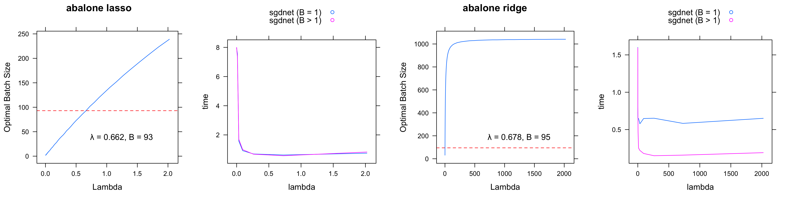
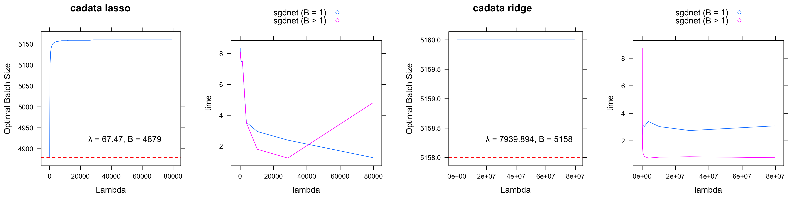
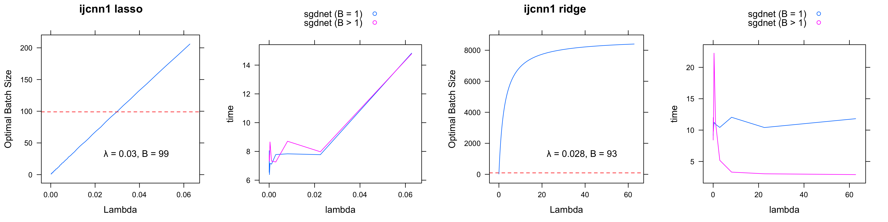
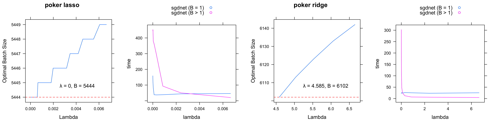
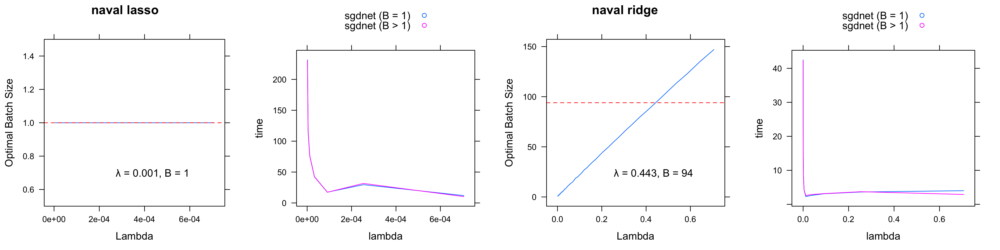

# Post-GSoC {-}
### Terminology {-} 

* $L$-Smooth: $f(y) \leq f(x) + \nabla f(x)^\intercal (y-x) + \frac{L}{2} \left \| y-x \right \|^2_2$

If $f$ is convex, an equivalent condition is that $f$ has $L$-Lipschitz continuous gradient: $\left \| \nabla f(x) - \nabla f(y) \right \|_2 \leq L \left \| x - y \right \|_2$

* $\mu$-Strongly Convex: $f(y) \geq f(x) + \nabla f(x)^\intercal (y-x) + \frac{\mu}{2} \left \| y-x \right \|^2_2$

It is a sufficient but not necessary condition for Polyak-Łojasiewicz (PL) inequality

* Polyak-Łojasiewicz (PL) inequality: $\frac{1}{2} \left \| \nabla f(x) \right \|^2_2 \geq \mu (f(x) - f^*)$

$f^* = f(x^*)$ is the optimal value. Also called $\mu$-strongly invex, which implies that all stationary points are global minimum

* $\beta (\mathbf{H})$: Smoothness of real symmetric matirx $\mathbf{H}$

$\beta (\mathbf{H}) = max \{ |\lambda_{max}(\mathbf{H})|, |\lambda_{min}(\mathbf{H})| \}$, where $\lambda_{max}(\mathbf{H})$ and $\lambda_{min}(\mathbf{H})$ are the largest and smallest eigenvalue of $\mathbf{H}$. This is equivalent to $\left | \mathbf{x}^\intercal \mathbf{H} \mathbf{x} \right | \leq \beta (\mathbf{H})$.

 If convex $f$ is twice differentiable, $L$-smoothness (or $L$-Lipschitz continuous gradient) leads to $\nabla^2 f \preceq L \mathbf{I}$ or $\beta (\nabla^2 f) \leq L$, which gives a way to approximate a smallest $L$.

For proof: [@Zhou2018]

### Linear Convergence {-}

If $f$ is $L$-smooth (which does not assume convexity):

$f(x) \leq f(y) + \nabla f(y)^\intercal (x-y) + \frac{1}{2} L \left \| x-y \right \|^2_2$

For gradient descent $x^{k+1} = x^{k} - \frac{1}{L} \nabla f(x^{k})$ with step size $\frac{1}{L}$:

$f(x^{k+1}) \leq f(x^k) - \frac{1}{2L} \left \| \nabla f(x^k) \right \|^2_2$

This step size is guaranteed to decrease the cost function

If $f$ also statisfies PL inequality:
$f(x^{k+1}) \leq f(x^k) - \frac{\mu}{L}(f(x^k) - f^*)$

$f(x^{k+1}) - f^* \leq (1-\frac{\mu}{L}) \left [ f(x^{k}) - f^* \right ] \leq (1-\frac{\mu}{L})^{k+1} \left [ f(x^{0}) - f^* \right ]$.

Since $\mu \leq L$, $(1-\frac{\mu}{L})^{k} \leq exp(-k \frac{\mu}{L}) \Rightarrow f(x^{k}) - f^* \leq C \text{exp}(-k\frac{\mu}{L})$, with $f(x^{0}) - f^* = C$.

To achieve an accuracy $\epsilon$: $f(x^k)-f^* \leq \epsilon$, we solve for the smallest $k = \frac{L}{\mu} \text{log} \frac{C}{\epsilon} = O(\text{log} \frac{1}{\epsilon})$ (linear convergence rate). The error between estimate at $k^{th}$ iteration and the optimal is bounded by an term that descreases expoentially with $k$. Therefore, a $L$-smooth function $f$ with PL inequality achives linear convergence rate to the optimal under gradient descent with $\frac{1}{L}$ as step-size. [@Karimi2016]

* If $f$ does not satisfy PL inequality (weaker than $\mu$-strongly convexity), $L$-smoothness can only achieve sublinear convergence rate with $k = O(\frac{1}{\epsilon})$ to have $\left \| \nabla f(x^k) \right \|_2 \leq \epsilon$

* Adding ridge penalty to a convex loss function makes it strongly convex.

### Variance Reduction Method{-}

The complexity of optimization algorithm relies both on the rate of convergence and computational cost for each iteration. The way to reduce the latter is to design a gradient estimator $g^k$ instead of using full batch.

For stochasitc gradient descent, $\mathbb{E} (g^k) = \mathbb{E} (\nabla _{i_k} f(x^k)) = \frac{1}{n} \sum_{i=1}^{n} \nabla f(x^k)$ is unbiased, however, its variance $\mathbb{V} (g^k) = \mathbb{E} \left ( \left \| \nabla _{i_k} f(x^k) -  \frac{1}{n} \sum_{i=1}^{n} \nabla f(x^k) \right \|^2_2  \right )$ does not converge to 0 even at the optimal point.
 

Under $L$-smoothness and PL inequality assumption, the stochastic gradient descent estimator gives 
$\mathbb{E} \left( f(x^{k+1}) - f^* \right) \leq ( 1 - 2 \alpha_k \mu) (f(x^k) - f^*) + \alpha_k^2 \frac{L}{2} \mathbb{E} \left ( \left \|\nabla f_{i_k} (x^k)\right \|_2^2 \right )$.
 

Suppose $\mathbb{E} \left ( \left \|\nabla f_{i_k} (x^k)\right \|_2^2 \right ) \leq C$ for some constant $C$, using a fixed step size $\eta$: 

$\mathbb{E} \left( f(x^{k+1}) - f^* \right) \leq (1-2\eta \mu)^{k+1} (f(x^0) - f^*) + \frac{\eta L}{2 \mu}[1-(1-2\eta \mu)^{k+1}] C$.

Its convergence requires a diminishing step size. Variance reduction methods come in to avoid such additional regime.

SAGA uses a better gradient estimator. SAGA maintians a updated gradient table with $\nabla f_i(\phi_i)$ for sample $i$. The lastest estimated gradient $g^{k-1} = \sum_{i=1}^n \nabla f_i (\phi _i^k)$ is the average of the gradient table, which is not explicitly calculated in every iteration. At iteration $k+1$, SAGA picks a $i_k$ at random and makes a quick fix to $g^{k-1}$ by $g^k = \nabla f _{i_k}(x^k) - \nabla  f_{i_k}(\phi _{i_k}^k) + g^{k-1}$, where $x^k$ is the coefficient obtained from last iteration and $f_{i_k}(\phi _{i_k}^k)$ is the latest $i_k^{\text{th}}$ entry of the gradient table. The $i_k^{\text{th}}$ entry of gradient table is updated $\nabla f_{i_k}(\phi _{i_k}^{k+1}) = \nabla f _{i_k}(x^k)$ with the rest remaining the same $\nabla f_{i}(\phi _{i}^{k+1}) = \nabla f_{i}(\phi _{i}^{k})$, $(i \neq i_k)$. The new $g^k$ is an unbiased estimator for average gradient at point $x^k$.

If $f$ is convex, as $x^k \rightarrow x^*$, $g^*$ converges to 0 with $\mathbb{E} (\left \| g^k \right \|_2^2) = 0$. To my knowledge, SAGA's performance on non-strong convexity or a weaker PL inequality or nonconvexity is not fully studied.

### More benchmark {-}

Due to the fact that overhead dominates when batch size is not large enough, in addtion to optimized batch size and step size, an additional consideration is forbidden a small optimal batch $( <100 )$. The following plot show [(R Sript)](https://github.com/wzzlcss/wzzlcss.github.io/blob/master/Rscript/pos-gsoc/path.R) the improvement along a regularization path (the predictors are standardized) with $\mathcal{B}^*$ and $\eta_{\text{optimal}}$, the largest $\lambda$ for $\mathcal{B}^* \leq 100$ or smallest $\mathcal{B}^*$ is highlighted. Optimized mini-batch is helpful for problem with ridge penalty and large $\lambda$. 

# Reference